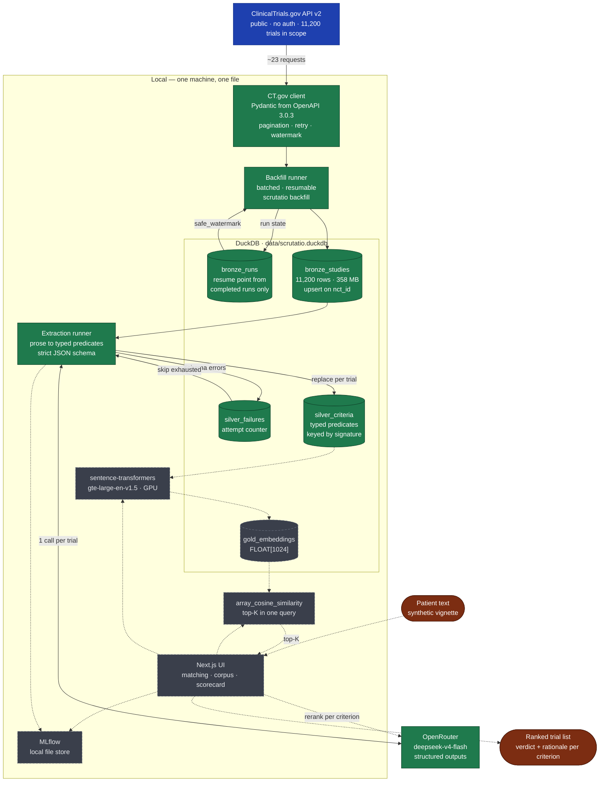

# Scrutatio

Free-text patient situation in — a ranked list of matching oncology trials out, each with a
verdict **per eligibility criterion**, a rationale, the NCT link, recruiting status and locations.

> ## ⚠️ Medical disclaimer
>
> **This is decision support, not medical advice.** The output is a prioritised list of candidate
> trials with per-criterion evidence, intended for review by a qualified healthcare professional —
> not an eligibility determination and not a recommendation.
>
> - Eligibility must **always** be verified with the study team or the treating oncologist.
> - Data comes from ClinicalTrials.gov and **may be out of date**; recruiting status and locations
>   change constantly.
> - Automated criterion checking is error-prone. The evidence is there to be read, not trusted.
> - **Do not enter real patient data.** Synthetic vignettes only — see [Privacy](#privacy).
>
> Not CE-marked. Not placed on the market as a medical device. Not clinically validated.
> Research and demonstration purposes.

---

## Status

**In development.** Bronze is done: 11,200 recruiting oncology trials in a single DuckDB file,
reloadable idempotently in about seven minutes. Extraction into Silver works and persists
resumably. Retrieval, matching, evaluation and the UI are still ahead.

The project ran on Databricks until 2026-08-16 and no longer does. The build worked there; the
one-time extraction pass did not. Measured throughput was ~550 trials/day on Free Edition and
**48/hour** on an Azure Premium workspace, against a corpus of 11,200 — a projection of roughly
ten days, and 364 trials actually completed. The cause was the model rather than the platform:
`gpt-oss-120b` is a reasoning model whose thinking tokens consume the output budget, so a third of
responses truncated mid-JSON and each truncation cost a second call.

Everything now runs locally except the LLM calls, which go over an API token.

## The problem

Screening a patient against trial criteria takes up to an hour per case according to NEJM AI.
Around 20% of trials fail on recruitment; in oncology only 2–8% of adults enrol. And the bottleneck
is not willingness: 55% of patients say yes when asked, but only one in four is ever matched.

The criteria are prose. Keyword search on ClinicalTrials.gov does not find them reliably —
"progression on osimertinib" and "progression on or after a third-generation EGFR TKI" share no
search term.

## Architecture

Solid = built, dashed = planned.



**Only one step leaves the machine, and it never sees a patient.** Extraction processes public
CT.gov text, so it has no privacy constraint and is free to use an external API. Matching is the
only step that ever touches a patient description. That split is why the extracted corpus is
portable: it contains no patient information at all, so it can be handed to anyone — including an
institution that wants to run the matching behind its own firewall.

| Layer | Contents | State |
| --- | --- | --- |
| **Bronze** | Raw CT.gov studies, idempotent upsert, incremental on `lastUpdatePostDate` | ✅ 11,200 trials |
| **Silver** | Eligibility prose to typed predicates in 20 categories, strict JSON schema, resumable via an extraction signature | ✅ built, full run pending |
| **Gold** | Embeddings over criteria and trials | planned |
| **Matching** | Patient text → embed → top-K → LLM checks every criterion per trial → ranking | planned |

Scope: interventional, recruiting oncology trials (`AREA[ConditionAncestorTerm]Neoplasms`) —
**11,200 trials** as of 2026-08-16.

## Setup

Requires [uv](https://docs.astral.sh/uv/) and Python 3.12+ (uv fetches it if needed).

```bash
git clone https://github.com/AlsoTheZv3n/scrutatio.git
cd scrutatio
uv sync --all-groups

cp .env.example .env    # add an OpenRouter API key
```

Verify:

```bash
uv run ruff check .
uv run pytest
```

There is no service to provision and no account to create beyond the API key. The database is a
file that appears on first use.

## Running the pipeline

```bash
uv run scrutatio status                  # progress across Bronze and Silver
uv run scrutatio backfill                # land the trial corpus (~7 min)
uv run scrutatio backfill --incremental  # only what changed since the last complete run
uv run scrutatio extract                 # extract criteria; resumes where it left off
uv run scrutatio extract --limit 200     # or in portions
```

Both runners are resumable by design. `backfill` upserts on `nct_id`, so a rerun updates rather
than duplicates, and only a run that walked the whole scope publishes a resume point. `extract`
commits every batch before fetching the next and skips trials already extracted under the current
signature.

## Design decisions

- **DuckDB, one file.** 11,200 studies and ~300,000 criteria is not a lakehouse problem. It also
  removes a class of failure: no warehouse to be unavailable, no catalog name that differs per
  workspace, no statement held server-side past a client timeout.
- **Vector search is a SQL function, not a service.** `FLOAT[1024]` columns and
  `array_cosine_similarity` cover top-K over 11,200 vectors in milliseconds.
- **Embeddings run locally.** `gte-large-en-v1.5` has an 8192-token window against a measured mean
  of ~835 tokens per eligibility text; `bge-large-en`'s 512 would truncate or force chunking.
- **One LLM call per trial** covering all criteria, not one per criterion — better Micro-F1 at
  close to an order of magnitude fewer tokens.
- **Extraction signature.** Every Silver row carries a hash of the model, system prompt and JSON
  schema. Changing any of them re-queues exactly the affected trials instead of leaving a silently
  mixed table. This was not hypothetical: growing the taxonomy from 9 to 20 categories invalidated
  every extraction made before it, and nothing in the data said so.
- **The watermark comes only from completed runs.** Deriving it from `max(last_update_posted)`
  looks equivalent and silently loses data — a run that dies at batch 12 of 23 has already landed
  the newest studies, so the next incremental pass starts after them and never fetches what never
  arrived.
- **Throttling does not retire a trial.** A 429 describes the moment, not the input. Counting it
  against the attempt budget permanently removes trials nothing is wrong with.
- **The taxonomy is described in the prompt, not just in the schema.** Listing only 12 of the 20
  categories left 35% of criteria in `other`; describing all 20 brought it to under 3%. A criterion
  in `other` cannot be matched against a patient later, so that bucket is a direct cap on recall.

## Corpus

Measured over a 4,000-trial sample (36% of the scope) on 2026-08-16:

| | |
| --- | --- |
| Eligibility characters, mean / median | 3,341 / 2,347 |
| p90 / p99 / max | 7,578 / 13,390 / 20,132 |
| Criteria per trial, mean / median / max | 26.6 / 22 / 169 |
| Extrapolated to 11,200 trials | 37.4M characters, ~298,000 criteria |

## Limits

Stated plainly rather than buried:

- **End to end, this system is not better than a good expert system.** In one oncology study (Wong
  et al., MLHC 2023) a hand-built rule system beat GPT-4 at 93.6% versus 76.8% recall. Defensible
  gains are at the retrieval and criterion level, not overall eligibility.
- **Boolean match logic is the weak point.** Even where entity recognition reaches 65–72 F1, full
  criterion composition drops to around 30 F1.
- Temporal criteria, therapy lines, lab thresholds and negation are documented failure modes of
  automated criterion checking.
- Ontology normalisation is deliberately shallow.
- Nothing here is evaluated yet. The quality gate — beating a CT.gov keyword baseline on a labelled
  benchmark — is designed but not run, and the retrieval half of it currently has no data path.

## Privacy

This project processes **synthetic patient vignettes only**. Trial data from ClinicalTrials.gov is
public domain, and the extraction step touches nothing else. The matching step is the only part
that reads a patient description, and it is not deployed anywhere.

## License

[Apache-2.0](LICENSE). Trial data from ClinicalTrials.gov (public domain, NLM). Evaluation datasets
keep their own licences.
