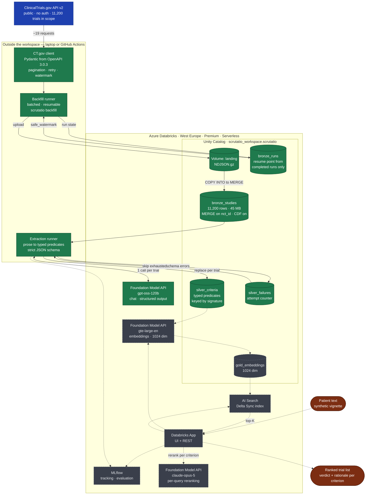

# Scrutatio

Free-text patient situation in — a ranked list of matching oncology trials out, each with a
verdict **per eligibility criterion**, a rationale, the NCT link, recruiting status and locations.

> ## ⚠️ Medical disclaimer
>
> **This is decision support, not medical advice.** The output is a prioritised list of candidate
> trials with per-criterion evidence, intended for review by a qualified healthcare professional —
> not an eligibility determination and not a recommendation.
>
> - Eligibility must **always** be verified with the study team or the treating oncologist.
> - Data comes from ClinicalTrials.gov and **may be out of date**; recruiting status and locations
>   change constantly.
> - Automated criterion checking is error-prone. The evidence is there to be read, not trusted.
> - **Do not enter real patient data.** Synthetic vignettes only — see [Privacy](#privacy).
>
> Not CE-marked. Not placed on the market as a medical device. Not clinically validated.
> Research and demonstration purposes.

---

## Status

**In development.** Bronze is done: 11,200 recruiting oncology trials, reloadable idempotently in
about four minutes. Extraction into Silver works and persists resumably — 11,053 criteria were
extracted from 364 trials before the platform was changed.

**The bulk extraction run is unsolved and the storage backend is being reconsidered.** Databricks
serves the corpus fine, but its Foundation Model API throughput did not support a one-time pass over
11,200 trials: Free Edition managed roughly 550 extractions per day and an Azure Premium workspace
48 per hour, against a corpus needing 11,200. Measurements and the post-mortem are in the internal
runbook. Retrieval, matching, evaluation and the UI are still ahead.

## The problem

Screening a patient against trial criteria takes up to an hour per case according to NEJM AI. Around
20% of trials fail on recruitment; in oncology only 2–8% of adults enrol. The criteria are prose —
keyword search on ClinicalTrials.gov does not find them reliably.

## Architecture

Medallion on Azure Databricks. Solid = built, dashed = planned.



**Why ingestion runs outside the workspace.** Serverless compute reaches only an unpublished
allowlist of domains, so whether `clinicaltrials.gov` is reachable from inside is an open question.
The write path therefore goes entirely through the SQL Statement Execution API — no Spark, no
`databricks-connect`. The same code runs on a laptop, in CI, or as a workspace job; where it runs
changes nothing about how it works.

| Layer | Contents | State |
| --- | --- | --- |
| **Bronze** | Raw CT.gov studies, idempotent via `MERGE`, incremental on `lastUpdatePostDate` | ✅ 11,200 trials |
| **Silver** | Eligibility prose to typed predicates in 20 categories, strict JSON schema, resumable via an extraction signature | ✅ built, full run pending |
| **Gold** | Embeddings over criteria and trials | planned |
| **Matching** | Patient text → embed → top-K → LLM checks every criterion per trial → ranking | planned |

Scope: interventional, recruiting oncology trials (`AREA[ConditionAncestorTerm]Neoplasms`) —
**11,200 trials** as of 2026-08-15.

## Setup

Requires [uv](https://docs.astral.sh/uv/) and Python 3.12 (uv fetches it if needed).

```bash
git clone https://github.com/AlsoTheZv3n/scrutatio.git
cd scrutatio
uv sync --all-groups

cp .env.example .env    # workspace URL, token, catalog name
```

Verify:

```bash
uv run ruff check .
uv run pytest
```

## Running the pipeline

```bash
uv run scrutatio status                  # progress across Bronze and Silver
uv run scrutatio backfill                # land the trial corpus (~4 min)
uv run scrutatio backfill --incremental  # only what changed since the last complete run
uv run scrutatio extract                 # extract criteria; resumes where it left off
uv run scrutatio extract --limit 200     # or in portions
```

Both runners are resumable by design. `backfill` merges on `nct_id`, so a rerun updates rather than
duplicates, and only a run that walked the whole scope publishes a resume point. `extract` commits
every batch before fetching the next and skips trials already extracted under the current signature.

## Design decisions

- **Python 3.12**, not newer — `databricks-connect` requires exactly `==3.12.*` and serverless
  executes 3.12.3.
- **Delta writes over the SQL Statement Execution API**, not Spark. Location-independent, and it
  sidesteps the serverless egress question entirely.
- **One LLM call per trial** covering all criteria, not one per criterion — better Micro-F1 at close
  to an order of magnitude fewer tokens.
- **Extraction signature.** Every Silver row carries a hash of the model endpoint, system prompt and
  JSON schema. Changing the taxonomy re-queues exactly the affected trials instead of leaving a
  silently mixed table. This was not hypothetical: growing the taxonomy from 9 to 20 categories
  invalidated every extraction made before it, and nothing in the data said so.
- **Concurrency is tuned, not maximised.** The serving endpoint reserves `max_tokens` against the
  per-minute output allowance *before* admitting a request, so concurrency multiplies the
  reservation. Measured on Premium: 1–2 workers produced zero 429s, 8 workers failed 6 of 8. The
  default is 3.

## Limits

Stated plainly rather than buried:

- **End to end, this system is not better than a good expert system.** In one oncology study (Wong
  et al., MLHC 2023) a hand-built rule system beat GPT-4 at 93.6% versus 76.8% recall. Defensible
  gains are at the retrieval and criterion level, not overall eligibility.
- **Boolean match logic is the weak point.** Even where entity recognition reaches 65–72 F1, full
  criterion composition drops to around 30 F1.
- Temporal criteria, therapy lines, lab thresholds and negation are documented failure modes of
  automated criterion checking.
- Ontology normalisation is deliberately shallow.

## Privacy

Databricks' Acceptable Use Policy classifies "health information identifiable to a particular
individual" as Prohibited Data. This project therefore processes **synthetic patient vignettes
only**. Trial data from ClinicalTrials.gov is public domain.

## License

[Apache-2.0](LICENSE). Trial data from ClinicalTrials.gov (public domain, NLM). Evaluation datasets
keep their own licences.
