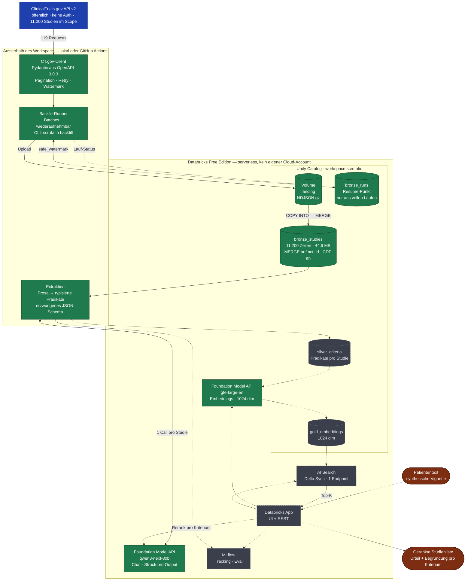

# Scrutatio

Freitext-Patientensituation rein — in Sekunden eine gerankte Liste passender Onkologie-Studien raus, jede mit einem Urteil **pro Eignungskriterium**, Begründung, NCT-Link, Rekrutierungsstatus und Standorten.

> ## ⚠️ Medizinischer Disclaimer
>
> **Dies ist Entscheidungsunterstützung, keine medizinische Beratung.** Die Ausgabe ist eine
> priorisierte Liste von Studienkandidaten mit Belegen pro Kriterium, gedacht zur Prüfung durch
> qualifiziertes medizinisches Fachpersonal — kein Eignungsurteil und keine Empfehlung.
>
> - Eignung ist **immer** mit dem Studienteam oder der behandelnden Onkologin zu verifizieren.
> - Daten stammen aus ClinicalTrials.gov und **können veraltet sein**; Rekrutierungsstatus und
>   Standorte ändern sich laufend.
> - Automatisierte Kriterienprüfung ist fehlerbehaftet. Belege sind zum Nachlesen da, nicht zum Vertrauen.
> - **Keine echten Patientendaten eingeben.** Nur synthetische Vignetten — siehe [Datenschutz](#datenschutz).
>
> Nicht CE-markiert. Nicht als Medizinprodukt in Verkehr gebracht. Nicht klinisch validiert.
> Forschungs- und Demonstrationszweck.

---

## Status

**In Entwicklung.** Bronze steht: 11.200 rekrutierende Onkologie-Studien liegen als Delta-Tabelle
in Unity Catalog, idempotent nachladbar. Die Extraktion nach Silver läuft gegen echte Studien und
ist wiederaufnehmbar persistiert. Retrieval, Matching, Evaluation und UI stehen noch aus.

## Das Problem

Patientinnen und Patienten gegen Studienkriterien zu screenen kostet laut NEJM AI bis zu einer
Stunde pro Fall. Rund 20 % der Studien scheitern an der Rekrutierung; in der Onkologie enrollen
nur 2–8 % der Erwachsenen. Die Kriterien liegen als Prosa vor — Keyword-Suche auf
ClinicalTrials.gov findet sie nicht zuverlässig.

## Architektur

Medallion auf Databricks Free Edition. Durchgezogen = gebaut, gestrichelt = geplant.



**Warum der Ingest ausserhalb läuft:** Free-Edition-Serverless erreicht nur eine
unveröffentlichte Allowlist an Domains — ob `clinicaltrials.gov` dazugehört, ist offen (Gate
G1). Der Schreibpfad läuft deshalb komplett über die SQL Statement Execution API, ohne Spark
und ohne `databricks-connect`. Derselbe Code läuft lokal, in CI oder als Job im Workspace — der
Ausführungsort ändert nur, wo der Prozess läuft, nicht den Aufbau.

| Ebene | Inhalt | Stand |
| --- | --- | --- |
| **Bronze** | Rohstudien aus CT.gov, idempotent per `MERGE`, inkrementell über `lastUpdatePostDate` | ✅ 11.200 Studien |
| **Silver** | Eligibility-Prosa → typisierte Prädikate in 20 Kategorien per LLM mit erzwungenem JSON-Schema, wiederaufnehmbar über eine Extraktions-Signatur | ✅ gebaut, Lauf offen |
| **Gold** | Embeddings über Kriterien und Studien | offen |
| **Matching** | Patiententext → embed → Top-K → LLM prüft alle Kriterien pro Studie → Ranking | offen |

Scope: interventionelle, rekrutierende Onkologie-Studien
(`AREA[ConditionAncestorTerm]Neoplasms`) — **11.200 Studien**, Stand 2026-08-15.

## Setup

Voraussetzungen: [uv](https://docs.astral.sh/uv/), Python 3.12 (uv holt es bei Bedarf).

```bash
git clone https://github.com/AlsoTheZv3n/scrutatio.git
cd scrutatio
uv sync --all-groups

cp .env.example .env    # Databricks-Host und Token eintragen
```

Prüfen:

```bash
uv run ruff check .
uv run pytest
```

Optional, empfohlen für Mitwirkende:

```bash
uv run pre-commit install
```

## Architekturentscheidungen

Die wichtigsten Randbedingungen:

- **Python 3.12**, nicht neuer — `databricks-connect` verlangt exakt `==3.12.*`, Serverless
  führt 3.12.3 aus.
- **Databricks Free Edition**, serverless-only. Kein eigener Cloud-Provider, kein eigener
  Storage. Eine AI-Search-Einheit, Delta Sync only.
- **Ein LLM-Call pro Studie** über alle Kriterien, nicht pro Kriterium — besseres Micro-F1
  bei knapp einer Größenordnung weniger Kosten.

## Grenzen

Bewusst offengelegt, nicht in Fußnoten versteckt:

- **End-to-end ist dieses System nicht besser als ein gutes Expertensystem.** In einer
  Onkologie-Studie (Wong et al., MLHC 2023) schlug ein handgebautes Regelsystem GPT-4 mit
  93,6 % gegen 76,8 % Recall. Verteidigbare Gewinne liegen auf Retrieval- und Kriterien-Ebene,
  nicht in der Gesamteignung.
- **Boolesche Match-Logik ist die Schwachstelle.** Auch wo Entitätserkennung 65–72 F1
  erreicht, fällt die vollständige Kriterien-Verknüpfung auf ~30 F1.
- Zeitliche Kriterien, Therapielinien, Laborschwellen und Negation sind dokumentierte
  Fehlerquellen automatisierter Kriterienprüfung.
- Ontologie-Normalisierung ist bewusst flach gehalten.

## Datenschutz

Databricks' Acceptable Use Policy stuft „health information identifiable to a particular
individual" als Prohibited Data ein. Dieses Projekt verarbeitet daher **ausschließlich
synthetische Patientenvignetten**. Studiendaten von ClinicalTrials.gov sind Public Domain.

## Lizenz

[Apache-2.0](LICENSE). Studiendaten stammen von ClinicalTrials.gov (Public Domain, NLM).
Evaluationsdatensätze behalten ihre jeweiligen Lizenzen.
