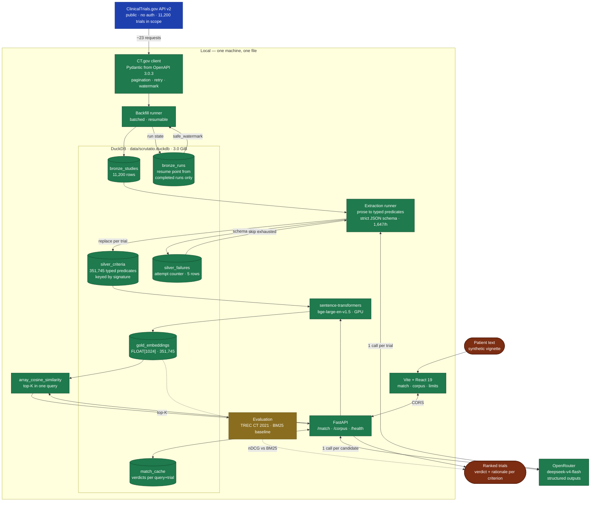

# Scrutatio

Free-text patient situation in — a ranked list of matching oncology trials out, each with a
verdict **per eligibility criterion**, a rationale, the NCT link, recruiting status and locations.

> ## ⚠️ Medical disclaimer
>
> **This is decision support, not medical advice.** The output is a prioritised list of candidate
> trials with per-criterion evidence, intended for review by a qualified healthcare professional —
> not an eligibility determination and not a recommendation.
>
> - Eligibility must **always** be verified with the study team or the treating oncologist.
> - Data comes from ClinicalTrials.gov and **may be out of date**; recruiting status and locations
>   change constantly.
> - Automated criterion checking is error-prone. The evidence is there to be read, not trusted.
> - **Do not enter real patient data.** Synthetic vignettes only — see [Privacy](#privacy).
>
> Not CE-marked. Not placed on the market as a medical device. Not clinically validated.
> Research and demonstration purposes.

---

## Status

**The pipeline runs end to end. Its quality is not yet established.**

| Layer | State |
| --- | --- |
| **Bronze** — raw CT.gov studies | ✅ 11,200 trials |
| **Silver** — typed eligibility predicates | ✅ 351,745 criteria across 11,195 trials |
| **Gold** — criterion embeddings | ✅ 351,745 vectors, 100% coverage |
| **Matching** — retrieve, then judge every criterion | ✅ answers in ~4 s warm |
| **HTTP API** — FastAPI, CORS | ✅ four endpoints |
| **Frontend** — Vite + React 19 + Tailwind 4 | ✅ three pages |
| **Evaluation** — TREC CT 2021 | ⚠️ **baseline measured, our system not yet** |

The whole corpus cost **$3.05** to extract and about eleven hours. The database is a single 3.0 GiB
file.

The project ran on Databricks until 2026-08-16 and no longer does. The build worked there; the
one-time extraction pass did not — 48 trials/hour against a corpus of 11,200. The cause was the
model, not the platform: `gpt-oss-120b` is a reasoning model whose thinking tokens consume the
output budget, so a third of responses truncated mid-JSON. Everything now runs locally except the
LLM calls, which go over an API token.

## The problem

Screening a patient against trial criteria takes up to an hour per case according to NEJM AI.
Around 20% of trials fail on recruitment; in oncology only 2–8% of adults enrol. The bottleneck is
not willingness: 55% of patients say yes when asked, but only one in four is ever matched.

Measured on this corpus: **31.4 eligibility criteria per trial** on average, up to 197, and 16.5% of
trials carry more than 50. Screening ten trials by hand means reading 314 criteria.

The criteria are prose in a single field. Keyword search does not find them reliably — a query for
*poor kidney function* returns nothing for the exact phrase, while the criteria that matter are
phrased *impaired renal function*.

## Architecture



**Only one step leaves the machine, and it never sees a patient.** Extraction processes public
CT.gov text, so it has no privacy constraint and is free to use an external API. Matching is the
only step that ever touches a patient description. That split is why the extracted corpus is
portable: it contains no patient information at all, so it can be handed to anyone — including an
institution that wants to run the matching behind its own firewall.

Scope: interventional, **recruiting** oncology trials
(`AREA[ConditionAncestorTerm]Neoplasms AND AREA[StudyType]INTERVENTIONAL`) — 11,200 trials as of
2026-08-16. Not the ~560,000 studies on ClinicalTrials.gov.

## Setup

Requires [uv](https://docs.astral.sh/uv/) and Python 3.12+ (uv fetches it if needed).

```bash
git clone https://github.com/AlsoTheZv3n/scrutatio.git
cd scrutatio
uv sync --all-groups --extra serve

cp .env.example .env    # add an OpenRouter API key
```

Add `--extra embeddings` for the GPU embedding stack (pulls torch), `--extra evaluation` for the
TREC harness.

Verify:

```bash
uv run ruff check .
uv run pytest                 # offline; live-service tests are skipped
uv run pytest --integration   # adds 26 tests that hit OpenRouter and CT.gov
```

There is no service to provision and no account to create beyond the API key. The database is a
file that appears on first use.

### Frontend

```bash
cd frontend
npm install
npm run dev          # http://localhost:5173
```

The dev server expects the API at `http://127.0.0.1:8000`. If it runs elsewhere, copy
`.env.example` to `.env` and set `VITE_API_BASE` — and make sure the dev server's origin is in the
backend's `api_cors_origins`, or the browser blocks every response before the app can report why.

## Running the pipeline

```bash
uv run scrutatio status                  # progress across every layer
uv run scrutatio backfill                # land the trial corpus (~7 min)
uv run scrutatio backfill --incremental  # only what changed since the last complete run
uv run scrutatio extract                 # prose to typed criteria; resumes where it left off
uv run scrutatio embed                   # criteria to vectors, GPU if available (~26 min)
uv run scrutatio search "58yo, EGFR+ NSCLC, ECOG 1"   # retrieval only, no judging
uv run scrutatio serve                   # the HTTP API the frontend talks to
```

Every runner is resumable by design. `backfill` upserts on `nct_id`, and only a run that walked the
whole scope publishes a resume point. `extract` and `embed` commit per batch and skip work already
done under the current signature.

## Evaluation

The project's definition of done requires beating a baseline on a labelled benchmark. Half of that
now exists.

**Benchmark:** TREC Clinical Trials 2021 — 75 topics, 35,832 judgements, 26,162 judged trials.
Graded relevance: `2` eligible, `1` excluded, `0` irrelevant. Metrics come from `pytrec_eval`,
which wraps NIST's own `trec_eval`; the harness was validated against known answers first (ranking
by the true label scores nDCG 1.0000, by its negation 0.0000).

| Run | nDCG@10 | nDCG@100 | recall@1000 |
| --- | --- | --- | --- |
| Random ranking (the floor) | 0.2135 | — | — |
| BM25 over eligibility text | 0.3643 | 0.3010 | 0.5325 |
| **BM25 over title + conditions + summary + eligibility** | **0.4048** | 0.3487 | 0.6200 |
| Scrutatio dense retrieval | **not yet measured** | | |

Two caveats that bound every number here:

- **The pool is not the corpus.** TREC judged 26,162 trials pooled from what 2021 participants
  retrieved out of ~375,000. Ranking inside that pool is easier than the real task, which is why a
  random ranking already scores 0.21. These numbers are **not** comparable to published TREC
  results — but a baseline and our system over the same pool are comparable to each other.
- **`P@10` counts label 1 as relevant** under trec_eval's default, and label 1 means the patient is
  *excluded*. Only nDCG uses the graded scale correctly, so nDCG is the number that matters.

BM25 is deliberately given every advantage: stopword removal, identical tokenisation, and the
stronger variant indexes everything a keyword search would actually have. Beating a handicapped
baseline would prove nothing.

## Design decisions

- **DuckDB, one file.** No warehouse to be unavailable, no catalog name that differs per workspace.
  The cost is real: DuckDB permits one read-write process and refuses every other one, so the API
  answers 503 while a pipeline run holds the file. That is the strongest argument for moving to
  PostgreSQL and is why the limitation is stated rather than hidden.
- **Vector search is a SQL function, not a service.** `FLOAT[1024]` columns and
  `array_cosine_similarity` cover top-K over 351,745 vectors in one query — currently a linear scan
  at 3.6 s, which is most of the warm latency budget and the next thing to fix.
- **Embeddings run locally**, `bge-large-en-v1.5`. An earlier version chose `gte-large-en-v1.5` for
  its 8192-token window, reasoning about whole eligibility texts at ~835 tokens. That reasoning does
  not apply: we embed *criteria*, which measure ~31 tokens, so the window stops being a
  differentiator and BGE wins on not requiring `trust_remote_code=True`.
- **One LLM call per trial** covering all criteria, not one per criterion — better Micro-F1 at close
  to an order of magnitude fewer tokens.
- **Extraction signature.** Every Silver row carries a hash of the model, reasoning flag, system
  prompt and JSON schema. Changing any of them re-queues exactly the affected trials. Growing the
  taxonomy from 9 to 20 categories invalidated every extraction made before it, and nothing in the
  data said so.
- **The watermark comes only from completed runs.** Deriving it from `max(last_update_posted)` looks
  equivalent and silently loses data — a run that dies at batch 12 of 23 has already landed the
  newest studies, so the next incremental pass starts after them.
- **Throttling does not retire a trial.** A 429 describes the moment, not the input.
- **The taxonomy is described in the prompt, not just in the schema.** Listing 12 of 20 categories
  left 35% of criteria in `other`; describing all 20 brought it to 4.06%. A criterion in `other`
  cannot be matched against a patient, so that bucket is a direct cap on recall.
- **Reasoning off, provider routing on.** Disabling reasoning cut output tokens 2.5–3.8×. Pinning
  `provider: {sort: throughput}` took sustained throughput from ~350 to ~1,647 trials/hour — 18
  providers serve the model, and a batch finishes when its slowest concurrent request does.
- **Bulk-load vectors through Arrow.** Profiled on a real batch: `executemany` was 95% of the
  embedding wall clock. Arrow brought it to ~1,395 rows/s and the full pass from ~4.5 h to ~26 min.

## Corpus

Measured 2026-08-17 over the full 11,195 extracted trials:

| | |
| --- | --- |
| Criteria | 351,745 |
| Per trial, mean / median / max | 31.4 / 28 / 197 |
| Trials with more than 50 criteria | 1,851 (16.5%) |
| Inclusion / exclusion | 171,150 / 180,595 |
| Categories in use | 20 of 20 |
| `other` | 4.06% |
| Trials that failed extraction | 5 (0.04%) |

The three largest categories are comorbidity (17.3%), lab (12.4%) and condition (10.9%). Consent,
compliance and contraception together are **11.9%** and no patient description can ever answer
them — the UI collapses them by default for that reason.

## Limits

Stated plainly rather than buried.

- **Retrieval quality is not evaluated.** The baseline above exists; our number does not. Until it
  does, every ranking is plausible rather than proven.
- **Retrieval discriminates weakly.** On a rich vignette the top ten candidates scored within 0.012
  of each other, and several were the wrong indication entirely. A trial is retrieved through its
  single most similar criterion, and generic criteria like *measurable disease per RECIST* match
  almost any oncology trial. The judging layer removes them afterwards, with reasons — but it pays
  a model call for candidates retrieval should not have proposed.
- **Most criteria cannot be decided from a description.** Measured over 226 criteria in five trials:
  a three-sentence vignette left **89%** unclear; one carrying age, stage, biomarkers, prior therapy,
  labs and infection status left **61%**. Decidable criteria tripled from the same trials. Input
  quality is the largest single lever on output quality.
- **End to end, this is not better than a good expert system.** In one oncology study (Wong et al.,
  MLHC 2023) a hand-built rule system beat GPT-4 at 93.6% versus 76.8% recall. Defensible gains are
  at the retrieval and criterion level, not overall eligibility.
- **Boolean match logic is the weak point.** Even where entity recognition reaches 65–72 F1, full
  criterion composition drops to around 30 F1. Temporal criteria, therapy lines, lab thresholds and
  negation are documented failure modes.
- Ontology normalisation is deliberately shallow.
- **MLflow tracking is declared but never wired.** Observability is a gap, not a feature.
- The corpus is a snapshot, not a live feed.

## Privacy

This project processes **synthetic patient vignettes only**. Trial data from ClinicalTrials.gov is
public domain, and the extraction step touches nothing else. The matching step is the only part that
reads a patient description; that text is sent to OpenRouter to be judged, which is why the rule is
synthetic vignettes and why the API says so in its own description.

Nothing is persisted about a query beyond a verdict cache keyed by a hash of the description.

## License

[Apache-2.0](LICENSE). Trial data from ClinicalTrials.gov (public domain, NLM). Evaluation datasets
keep their own licences.
